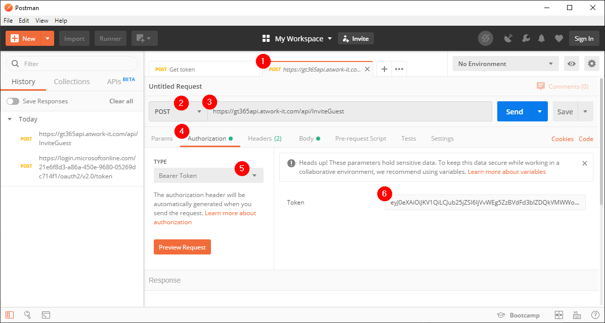
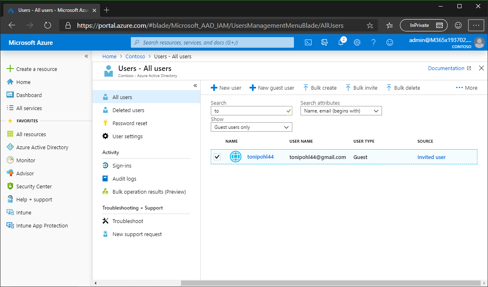
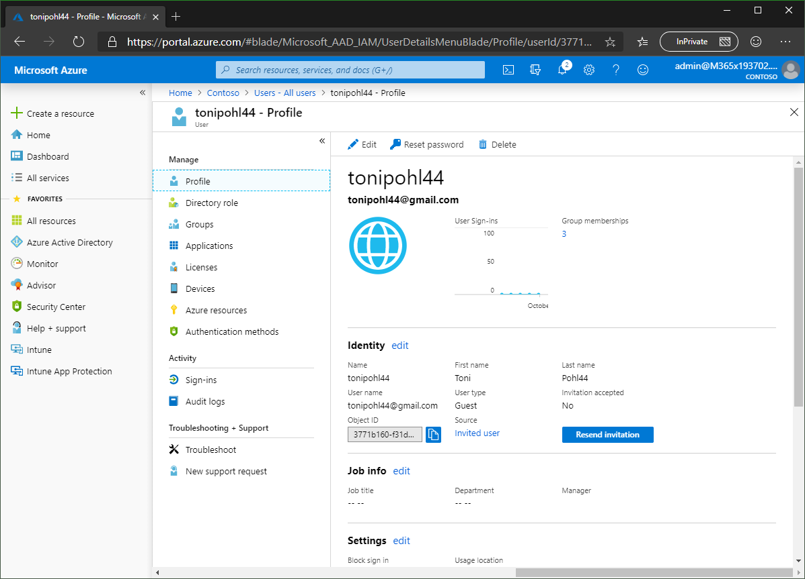
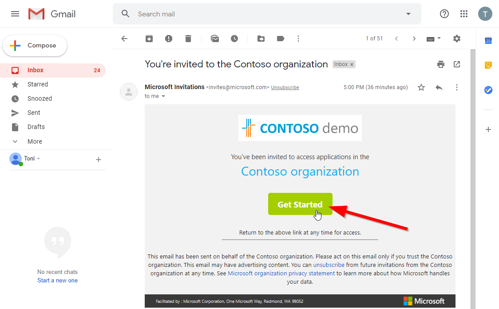
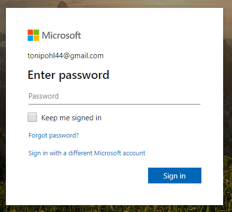
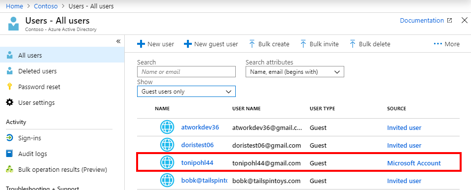

# [Invite guests with the API](#invite-guest-asp)

Once you have [created the app](./API-create-app.md) in your Microsoft 365 tenant, we can use that app to access the GT365 API.

The concept is the same as working with the GT365 API to provision a new group. You need to get a token and send that to the GT365 API. Here, we assume, you already have a valid token. This article here is using [Postman](https://www.getpostman.com/downloads/).

Follow the steps to invite a guest user to your Microsoft 365 tenant.

- Get a new token as described at [API-Provisioning](./API-provisioning.md).
- In Postman, create a new request. This is a **POST** request against the GT365 endpoint https://governancetoolkit365.azurewebsites.net/api/InviteGuest. Copy the current **access_token** value in the Authorization Token field as shown here.

- Now, it´s time to add the payload for the API call. Submit a body in the following form, as shown in the screenshot. Click on "Body", add the JSON data (see below) and click "Send". You will see the result in the panel below.

## Invite a user to your tenant

The HTTP POST request sends data with Content-Type "application/json".

~~~~json
"method": "POST",
"header": [
  {
    "key": "Content-Type",
    "name": "Content-Type",
    "type": "text",
    "value": "application/json"
  }
],
"body": { <...see below...> }
~~~~

Use this sample payload in the as header and body and adapt it as needed.

~~~~json
{
  "invitedUserDisplayName":"John Doe",
  "invitedUserEmailAddress": "john.doe@gmail.com",
  "inviteRedirectUrl": "https://mycompany.com/guestinfo",  
  "sendInvitationMessage": true,
  "requestedBy":"adele.vance@mycompany.com"
}
~~~~

## API results

- The request usually runs for some seconds, depending on the availability of the GT365 API. You will receive a HTTP status message after the operation has been completed.
- You get back a HTTP status code and a JSON message informing about the new group or any error message.

In case the invitation was created successfully, you get back a result with a **HTTP status code 201 Created**. The result delivers an *id*, the *invitedUserEmailAddress*, an *inviteRedeemUrl*, a *status*, and a *sendInvitationMessage* as here.

~~~~json
{
    "id": "3771b160-f31d-4d46-a2da-f785b6a8c1ed",
    "invitedUserEmailAddress": "some.name@somedomain.org",
    "inviteRedeemUrl": "https://invitations.microsoft.com/redeem/
       ?tenant={TenantID}&user={UserID}]&ticket={TicketID}&ver=2.0",
    "status": "PendingAcceptance",
    "sendInvitationMessage": true
}
~~~~

- Check the invitation with Microsoft Graph, the Azure Portal or another mechanism. In this sample, the users are filtered by Guest users. The result can look similar as here.  

- You can check the invitation in the Azure Portal or resend the invitation if needed.

- The invited user has to accept the invitation by clicking a link. The URL looks similar as here:
https://invitations.microsoft.com/redeem/?tenant={TenantID}&user={UserID}&ticket={TicketID}&ver=2.0

- The user gets redirected to https://login.live.com/ and needs to enter a new password and he needs to follow the steps (depending on the organization´s security configuration).

- After a successful sign-in, the user is added as a guest user in the Microsoft 365 tenant.
- After the user has consentend, the user status in AAD will be changed to "Work Account" or "Microsoft Account", depending on the user type.

- The use status then has changed to "nvitationI accepted: Yes".

- Now the invited user can be used for collaboration in Microsoft 365.

## Error messages

If an error occurs during the operation, you get back a HTTP 500 internal error status.  
In such cases, correct the data and retry.

## Use from any client

This sample shows the process how to use the GT365 API. You can test the API with Postman and then develop the API request from a Mirosoft Flow or Azure Logic App or from your own applications.

## Quick navigation

[ReadMe](https://github.com/delegate365/GovernanceToolkit365/) &middot; [API](./API.md) &middot; [API-Create-App](./API-create-app.md) &middot; [API-Provisioning](./API-provisioning.md) &middot; [API-Provisioning-Flow](./API-provisioning-flow.md) &middot; [API-Invite-Guests](./API-invite-guest.md) &middot; [Newsletter](./newsletter.md) &middot; [Power-BI](./power-bi.md) &middot; [GT365](https://governancetoolkit365.com/)
