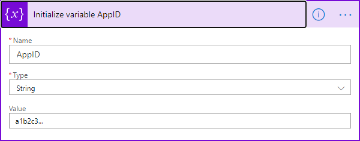
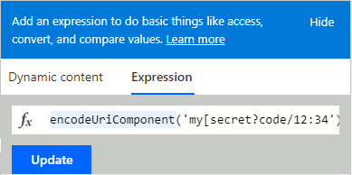
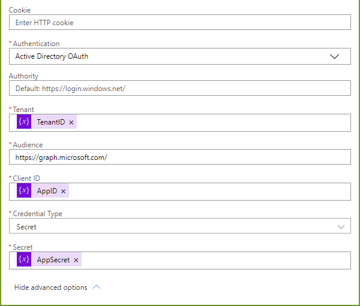
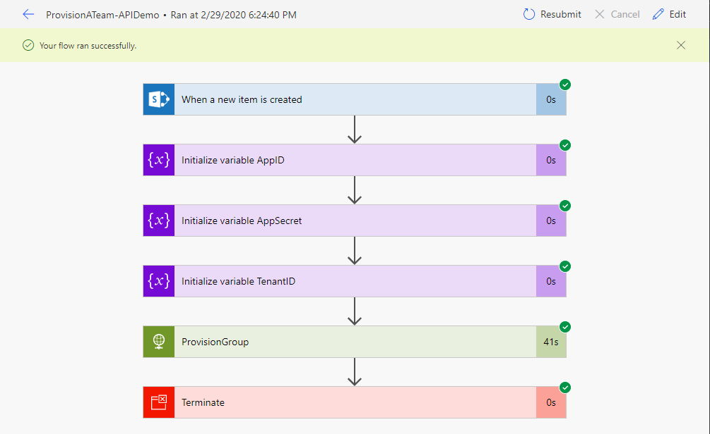
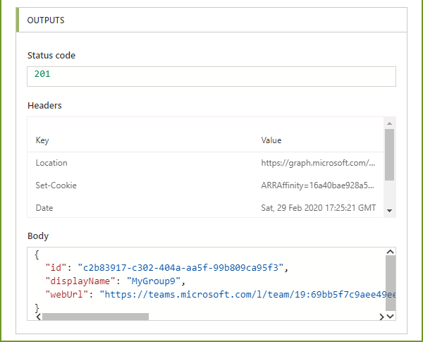
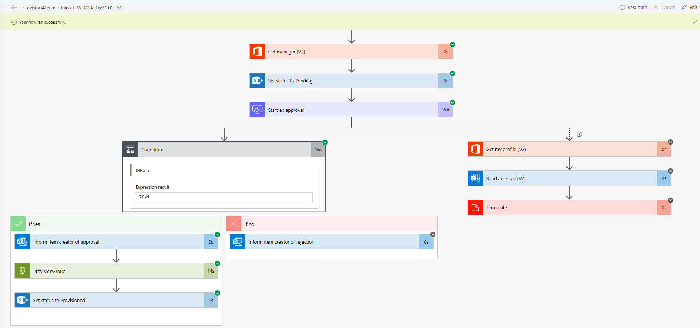

# [Use the API from Flow](#use-the-api)

Once you have [created the app](./API-create-app.md) in your Microsoft 365 tenant, we can use that app to access the GT365 API.

The security concept is to get a token for the own tenant first. Then send that token to the GT365 API, so that it is allowed to provision a new Office 365 group. The token usually is valid only for about 60 minutes and expires then.

As prerequesits, you need to have the app data from the step before, similar as here.

| Key | Value |
|:----|:------|
| AppID | 91eef8ad...
| AppSecret | /95=BRZ...
| TenantID | 21e6f8d3...

This document describes the basic steps when using the GT365 Provisioning API from Microsoft Flow.

Follow the steps to provision a new Office 365 Group or Team.

- Create a new Flow to test the GT365 API.
- The following screenshot shows an overview of the actions.

- **Trigger:** Create a trigger to test your Flow. This can be a HTTP call, a newly added item to a SharePoint list or any other trigger. Here, we use a SPO list. Once a new item is added, the Flow starts.

- **AppID:** Add a new action "Initialize Variable", Use "AppID" as name and add your AppID from AAD as value.

- **AppSecret:** Add a new action "Initialize Variable", Use "AppSecret" as name and add your AppSecret from AAD as value.

- **TenantID:** Add a new action "Initialize Variable", Use "TenantID" as name and add your TenantID from AAD as value.

- **Tip:** If one of the values contains special characters, you can use a formula that ensures that any special characters are properly encoded as follows:
~~~
encodeUriComponent('my[secret?code/12:34')
~~~

- Add a new action "HTTP" and configure it using a HTTP POST action to the endpoint and add Content-Type and the body as here:
~~~
https://gt365api.atwork-it.com/api/ProvisionGroup

Content-Type application/x-www-form-urlencoded
~~~

- Then, add the required parameters as here (filled from the SPO list or from other parameters).
~~~
{
  
  "displayName": "@{triggerBody()?['Title']}",
  "mailNickname": "@{triggerBody()?['Title']}",
  "description": "@{triggerBody()?['Title']}",
  "ownerUPNs": [
    "@{triggerBody()?['Author']?['Email']}"
  ],
  "memberUPNs": [
    "@{triggerBody()?['Author']?['Email']}"
  ],
  "createTeam": @{triggerBody()?['CreateTeam']},
  "visibility": "@{triggerBody()?['Visibility']?['Value']}"
}
~~~
- In the HTTP action, open the "Open advanced options".
- Configure the advanced options as here:

- As Authentication select **Active Directory OAuth**
- In the Tenant field, add the **@{variables('TenantID')}**
- As Audience, add **https://graph.microsoft.com/**
- In the Client ID field, add the **@{variables('AppID')}**
- Select the Credential Type **Secret**
- In the Secret field, add the **@{variables('AppSecret')}**
- Done. Continue with other actions in your Flow or add a Terminate action.
- Save the flow.

## Test it

When the Flow is triggered, it should show an output similar as here.

The work is done in the ProvisionGroup action. The API returns a HTTP status code 201 and looks similar as here.

As Body, the new Group *id* and the *displayName* is returned.

## Integrate the Provisionging Flow in your Approval Workflow

A complete approval workflow could look like here. 

If an error occured, the right branch is executed and the Flow terminates. Otherwise, if approved by the manager, the left condition branch provisions a group.

## Adapt it as needed

This sample shows the process how to use the GT365 API from Microsoft Flow or Microsoft Azure Logic Apps.

**Quick navigation**

[ReadMe](https://github.com/delegate365/GovernanceToolkit365/) &middot; [API](./API.md) &middot; [API-Create-App](./API-create-app.md) &middot; [API-Provisioning](./API-provisioning.md) &middot; [API-Provisioning-Flow](./API-provisioning-flow.md) &middot; [API-Invite-Guests](./API-invite-guest.md) &middot; [Newsletter](./newsletter.md) &middot; [Power-BI](./power-bi.md) &middot; [GT365](https://governancetoolkit365.com/)
