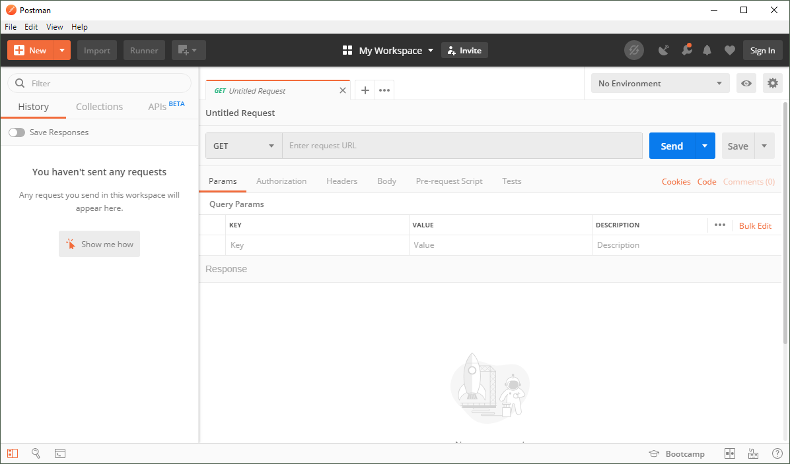
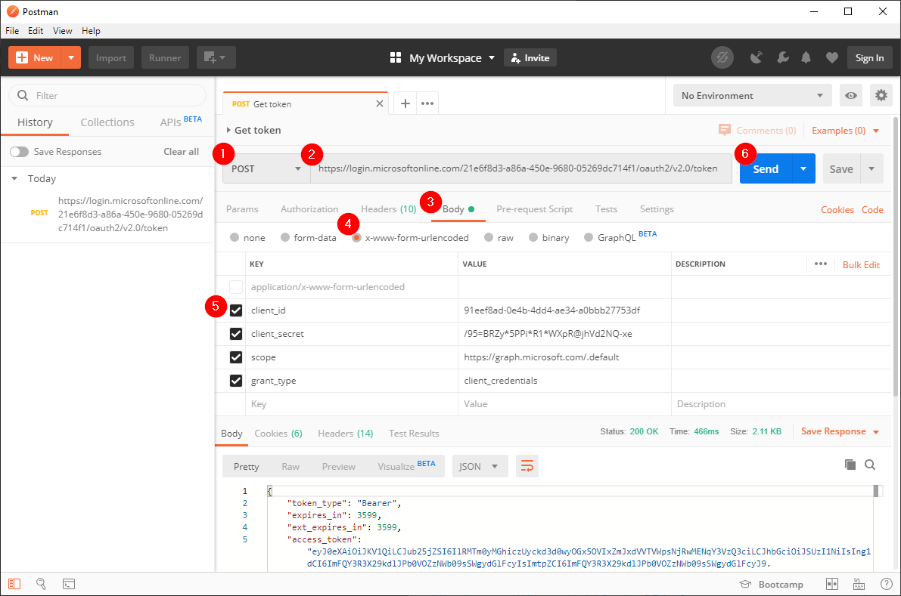
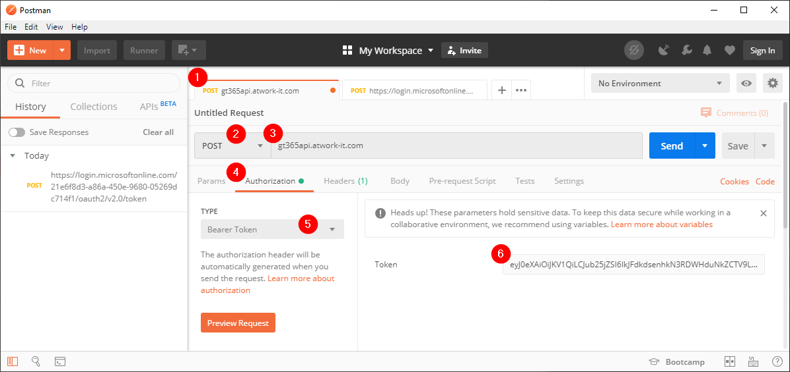
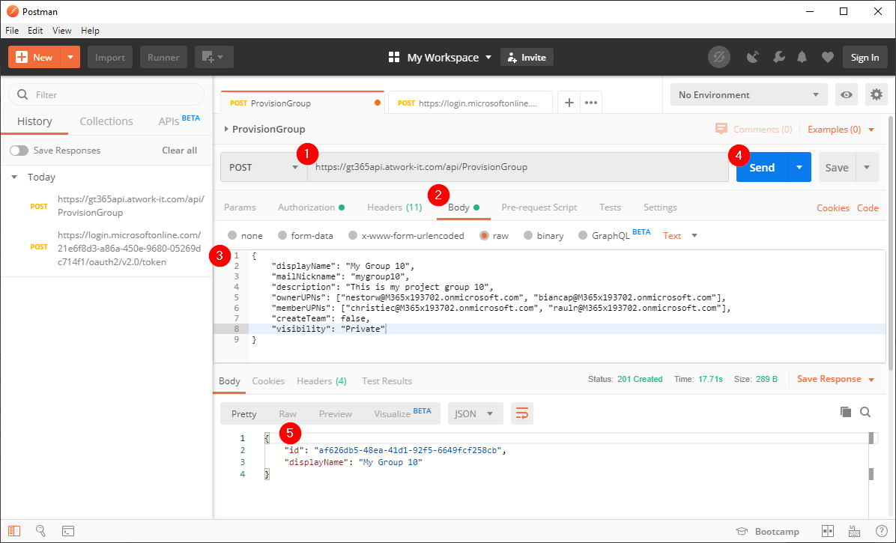
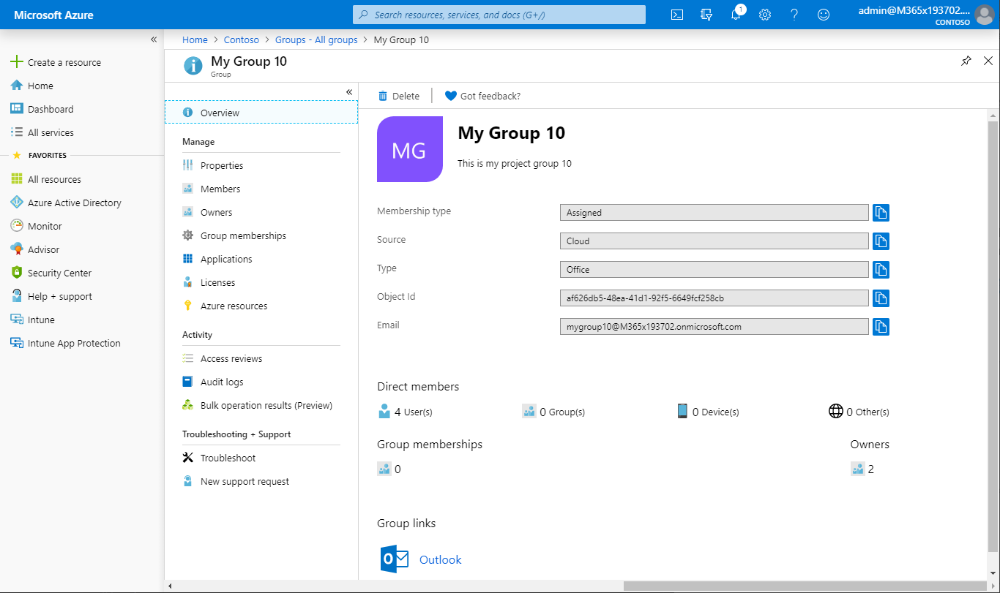

# [Use the API](#use-the-api)

One you have [created the app](./API-create-app.md) in your Microsoft 365 tenant, we can use that app to access the GT365 API.

The security concept is to get a token for the own tenant first. Then send that token to the GT365 API, so that it is allowed to provision a new Office 365 group. The token usually is valid only for about 60 minutes and expires then.

As prerequesits, you need to have the app data from the step before, similar as here.
| Key | Value |
|:----|:------|
| AppID | 91eef8ad...
| AppSecret | /95=BRZ...
| TenantID | 21e6f8d3...

Use a tool to test the HTTP API requests. You can use any tool. This article here is using [Postman](https://www.getpostman.com/downloads/).

Follow the steps to provision a new Office 365 Group or Team.

- Postman allows to work with HTTP requests. After installing and opening the app, it looks empty as here.

- Fill in a **POST** request to get an access token with your app data. Find the documentation at [Get an access token](https://docs.microsoft.com/en-us/graph/auth-v2-service#4-get-an-access-token). Create a new HTTP POST request with the URI of https://login.microsoftonline.com/{tenant}/oauth2/v2.0/token
and add the key and value pairs with your own app data (the table you wrote down as above). We need to pass the **client_id, client_secret, scope** and the **grant_type** as a **application/x-www-form-urlencoded** formatted request as in the following graphics. Click "Send" when done.

- After sending the request, you get the **access_token** value for the request against the GT365 API. We need to pass that value in the Authorization header for the GT365 API call.

- Create a new request. This also is a **POST** request against the GT365 endpoint https://gt365api.atwork-it.com/api/ProvisionGroup. Copy the current **access_token** value in the Authorization Token field as shown here.

- Now, it´s time to add the payload for the API call. Submit a body in the following form, as shown in the screenshot. Click on "Body", add the JSON data (see below) and click "Send". You will see the result in the panel below.

**Provision an Office 365 Group**
Use this sample payload in the Body and adapt it as needed.

~~~~json
{
    "displayName": "My Group 10",
    "mailNickname": "mygroup10",
    "description": "This is my project group 10",
    "ownerUPNs": ["nestorw@M365x193702.onmicrosoft.com",
                  "biancap@M365x193702.onmicrosoft.com"],
    "memberUPNs": ["christiec@M365x193702.onmicrosoft.com",
                   "raulr@M365x193702.onmicrosoft.com"],    
    "createTeam": false,
    "visibility": "Private"
}
~~~~

To provison an Office 365 Group only, just the follwoing keys are mandatory: **displayName, mailNickname and visibility**.

The other keys can be provided if required. Usually, it makes sense to use the additional parameters to define the classification (that must be set in advance), the owners, and other group properties. So, we recommend to set as many properties that are already known at this time.

Most keys are string. The following keys can have these predefined values.

|Key   |Value  |
|:-----|:------|
|createTeam | true&#124;false |
|visibility | Private&#124;Public |
|classification | Values must be set in the classification policy before they can be used as string here, e.g. "confidential" if set. See more [here](https://blog.atwork.at/post/2019/05/02/Groups-Governance-Toolkit-Policies). |

**Provision a Microsoft Team**

To provision a Team, use this sample payload and adapt it as needed.

~~~~json
{
    "displayName": "My Team 12",
    "mailNickname": "myteam12",
    "description": "This is my project team 12",
    "ownerUPNs": ["nestorw@M365x193702.onmicrosoft.com", "biancap@M365x193702.onmicrosoft.com"],
	"memberUPNs": ["christiec@M365x193702.onmicrosoft.com", "raulr@M365x193702.onmicrosoft.com"],    
    "createTeam": true,
    "visibility": "Private"
}
~~~~

If **createTeam** is **true** you have to provide at least one owner addtionially in the **ownerUPNs** array ["UPN1"].

**API results**

- The request can take from some seconds to 2 minutes, depending on the availability of the GT365 API. You will receive a HTTP status message after the operation has been completed.
- You get back a HTTP status code and a JSON message informing about the new group or any error message.

In case the provisioning was successful, you get back a result with a **HTTP status code 201 Created**. For a Group, the result delivers the new Group *id* and the *displayName* as here.

~~~~json
{
    "id": "af626db5-48ea-41d1-92f5-6649fcf258cb",
    "displayName": "My Group 10"
}
~~~~

For a Team, the result delivers an additional key *webUrl* as here.

~~~~json
{
    "id": "f9b03b74-211a-4014-99cf-0d058327abcf",
    "displayName": "My Team 12",
    "webUrl": "https://teams.microsoft.com/l/team/19:3cbdd355af8c432f86a208f587637d7e%40thread.skype/conversations?groupId=f9b03b74-211a-4014-99cf-0d058327abcf&tenantId={TenantId}"
}
~~~~

- Check the created group or Team with Microsoft Graph, the Azure Portal or another mechanism. In this sample, the result looks as here. There are 2 group owners and in total 4 members (2 members plus the 2 owners).

## Error messages

If an error occurs during the operation, you get back a result with an "error" key as in the following samples.

If you send an invalid or expired token, the following message is returned.

~~~~json
{
  "error": {
    "code": "InvalidAuthenticationToken",
    "message": "CompactToken parsing failed with error code: 80049217",
    "innerError": {
      "request-id": "2f286794-6102-4009-9b50-300118150029",
      "date": "2019-10-01T07:19:34"
    }
  }
}
~~~~

If the request is mispelled or data is missing, you get a message, for example.

~~~~json
No visibility (Private|Public) was provided or had a wrong label.
~~~~

If the request sends data that cannot be set, you get a corresponding message. In this sample, a classification was sent, but the value ist not set in the policy of the tenant.

~~~~json
{
  "error": {
    "code": "Request_BadRequest",
    "message": "Property classification has an invalid value.",
    "innerError": {
      "request-id": "20567d85-74c6-49c8-a59a-5775863335f1",
      "date": "2019-10-01T07:22:13"
    },
    "details": [
      {
        "target": "classification",
        "code": "InvalidValue"
      }
    ]
  }
}
~~~~

If the request tries to create a group that is already existing, you get a message as here:

~~~~json
{
  "error": {
    "code": "Request_BadRequest",
    "message": "Another object with the same value for property mailNickname already exists.",
    "innerError": {
      "request-id": "decda332-fced-4983-be86-f01bda33175e",
      "date": "2019-10-01T07:16:35"
    },
    "details": [
      {
        "target": "mailNickname",
        "code": "ObjectConflict"
      }
    ]
  }
}
~~~~

If the request sends data that is not existing in the tenant, you get a message as here:

~~~~json
{
  "error": {
    "code": "InvalidRequest",
    "message": "Team owner not found for 5a6b746c-57eb-4d74-85c8-101af25d8b70.",
    "innerError": {
      "request-id": "3800e5a5-cc6c-4af0-b337-894d24025ab9",
      "date": "2019-10-01T07:40:21"
    }
  }
}
~~~~

In such cases, correct the data and retry.

## Use from any client

This sample shows the process how to use the GT365 API. You can test the API with Postman and then develop the API request from a Mirosoft Flow or Azure Logic App or from your own applications.

**Quick navigation**
[ReadMe](./readme.md) &middot; [API](-/API.md) &middot; [API-Create-App](./API-create-app.md) &middot; [API-Provisioning](./API-provisioning.md) &middot; [Newsletter](./newsletter.md) &middot; [Power-BI](./power-bi.md) &middot; [GT365](https://governancetoolkit365.com/)
